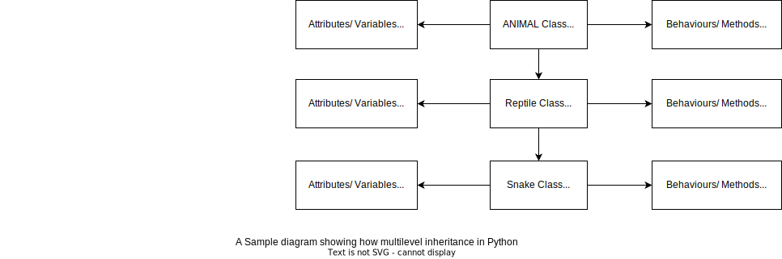

# Object Oriented Programming in Python

#### Use Case - Benefits - example of built-in packages and libraries

- Built-in Methods increases re-usability of the code.
- By re-using code the overall size of the code is reduced.
- Code can be simplified by modularizing with the help of method.

#### Import keyword

The import keyword finds and loads a package, a sub-package or a module if they are found in the system using the import mechanism.

#### Random Method
The `random()` method returns a random floating number between 0 and 1.
```commandline
# Example Use Case - Lucky Draw
 
import random

print(random.random())
```
## Movie Ratings second iteration

```
# Program to check for what movies a user can watch

def rating(age):
    if age > 18:  # If adult, you can watch any movies.
        print("You are " + user_age + " year Old. You can watch any movies you like")
    elif age > 15:  # If Older than 15
        print("You are " + user_age + " year Old. You can only watch \"U\" , \"PG\", \"12\" and, \"15\" rated movies")
    elif age > 12:
        print("You are " + user_age + " year Old. You can only watch \"U\" , \"PG\" and, \"12\" rated movies")
    elif age > 8:
        print("You are " + user_age + " year Old. You can only watch \"U\" and \"PG\" rated movies")
    else:
        print("You are " + user_age + " year Old. You can only watch \"U\" rated movies")


user_prompt = True

while user_prompt:
    user_age = input("Please enter your age: ")  # Ask User for their age
    if user_age.isdigit():  # Checks if the user has input numbers only
        if int(user_age) < 117:  # Checks if the user is less than 117 years old
            user_prompt = False
        else:
            print("You must be less than 117 Years Old!")
    else:
        print("Please enter a valid number")

# Calling the function which determines the rating of the user
rating(int(user_age))

Output:
Please enter your age: 17
You are 17 year Old. You can only watch "U" , "PG", "12" and, "15" rated movies
```

## Age Calculator second iteration
```
def calculate_age(age):
    return 2022 - int(age)


user_prompt = True

while user_prompt:
    age = input("Please Enter your Age: ")
    if age.isdigit():
        user_prompt = False
    else:
        print("Please enter your age in digits only")

print(f"You were born in {calculate_age(age)}")  # Output: Displays the year user was born

Output:
Please Enter your Age: 38
You were born in 1984
```
## Fizz Buzz second iteration
```
# Define a method to print Fizz
def fizz():
    print("Fizz")


# Define a method to print Buzz
def buzz():
    print("Buzz")


# Define a method to print FizzBuzz
def fizzbuzz():
    print("FizzBuzz")


# Ask user to choose the number for Fizz
fizz_number = int(input("On which number's multiple do you want to print \"Fizz\": "))

# Ask user to choose the number for Buzz
buzz_number = int(input("On which number's multiple do you want to print \"Buzz\": "))

# Loop the given range 1 to 100 and print the matching word if condition met else print the number itself
for num in range(1, 101):
    if num % fizz_number == 0 and num % buzz_number == 0:
        fizzbuzz()
    elif num % fizz_number == 0:
        fizz()
    elif num % buzz_number == 0:
        buzz()
    else:
        print(num)
```
## Restaurant Helper second iteration

### Method to hold the menu

```
# Define a method that contains the menu item and returns
def menu_items(category):
    menu_list = {
        "starter": ["Salmon Platter", "Oyesters", "Pappadum", "Empanadilas", "Vol-au-vents", "Dumpling", "Canape"],
        "mains": ["Pasta Bake", "Tteokbokki", "Yakisoba", "Nigri", "Thai Green Curry", "Burger", "Paella", "Pizza"],
        "desserts": ["Cream Brulee", "Mochi", "Apple Pie", "Gulab Jamun", "Dadar Gulung", "Kremes"]
    }
    if category == "starter":
        return menu_list["starter"]
    elif category == "mains":
        return menu_list["mains"]
    elif category == "desserts":
        return menu_list["desserts"]
    else:
        return menu_list
```

### Function to print
```
def display_items(items, category):
    print(f"\n ***** {category.capitalize()} list *****")  # For formatting purpose only
    for item in range(len(items)):
        print(item+1, ".", items[item])  # Prints all the items that is in the list
```

### Function to take order
```
# Define a method that takes the order
def take_order(category):
    available_items = menu_items(category)  # Get the available items from the menu items
    display_items(available_items, category)  # Displays all the available items
    order_item = input(f"Please select Your {category.capitalize()}: ")  # Customer selects what they want
    if order_item.isdigit():
        return available_items[int(order_item)-1]  # the selected item is returned to be appended to order list
```

### Main Body
```
order_list = []  # List to hold the order
print("Welcome to \"XYZ\" Restaurant!")
order_list.append(take_order("starter"))     # Starter Order
order_list.append(take_order("mains"))       # Mains Order
order_list.append(take_order("desserts"))    # Desserts Order
display_items(order_list, "customer order")  # Displays the Customer Order
```

### Output
```
Welcome to "XYZ" Restaurant!

 ***** Starter list *****
1 . Salmon Platter
2 . Oyesters
3 . Pappadum
4 . Empanadilas
5 . Vol-au-vents
6 . Dumpling
7 . Canape
Please select Your Starter: 6

 ***** Mains list *****
1 . Pasta Bake
2 . Tteokbokki
3 . Yakisoba
4 . Nigri
5 . Thai Green Curry
6 . Burger
7 . Paella
8 . Pizza
Please select Your Mains: 2

***** Desserts list *****
1 . Cream Brulee
2 . Mochi
3 . Apple Pie
4 . Gulab Jamun
5 . Dadar Gulung
6 . Kremes
Please select Your Desserts: 2

 ***** Customer order list *****
1 . Dumpling
2 . Tteokbokki
3 . Mochi
```

### OOP Code along diagram

- Step 1: create animal.py as parent
- Step 2: create reptile.py as a child
- Step 3: create snake.py and inherit from reptile
- Step 4: create python_oop.py

<p align="center>
  
</p>

